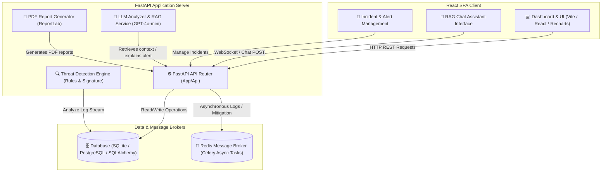

# 🛡️ AI-Powered SOC Analyst Assistant

An intelligent, next-generation Security Operations Center (SOC) Assistant designed to help security analysts ingest logs, detect threats, automate alert explanations using LLMs, map tactics to the MITRE ATT&CK framework, and generate mitigation/incident reports.

---

## 🏗️ System Architecture

The following diagram illustrates the flow of data from log ingestion down to threat detection, AI explanation, incident reporting, and the interactive dashboard.



---

## 🚀 Key Features

*   **📥 Log Ingestion:** Fast endpoints (`POST /logs/ingest`) to ingest raw log formats.
*   **🚨 Automated Threat Detection:** Real-time analysis detecting brute force attacks, privilege escalation, suspicious PowerShell download scripts, and port scans.
*   **🤖 AI Alert Explanation:** Integration with OpenAI's `gpt-4o-mini` to automatically explain alert severity, risks, and immediate remediation steps.
*   **🛡️ MITRE ATT&CK Mapping:** Automatic mapping of alert categories to specific MITRE techniques (e.g., T1110 for Brute Force, T1068 for Privilege Escalation) using a semantic RAG (Retrieval-Augmented Generation) lookup.
*   **📝 Incident Management & PDF Reports:** Track incident lifecycles, and generate downloadable professional summary reports utilizing ReportLab.
*   **💬 RAG Chat Assistant:** Real-time conversational AI assistant that contextually references MITRE ATT&CK mapping database.
*   **📊 Interactive Dashboard:** Visual dashboard built in React using Recharts displaying active alerts, severity distributions, and threat trends.

---

## 🛠️ Technology Stack

### Backend
*   **Framework:** [FastAPI](https://fastapi.tiangolo.com/) (Python 3)
*   **Database ORM:** [SQLAlchemy](https://www.sqlalchemy.org/)
*   **Default Database:** SQLite (supports PostgreSQL integration)
*   **Task Queue:** [Celery](https://docs.celeryq.dev/) with [Redis](https://redis.io/)
*   **AI Models:** OpenAI API (`gpt-4o-mini`) via [LangChain](https://www.langchain.com/) & ChromaDB
*   **Document Generation:** [ReportLab](https://www.reportlab.com/) (PDF format)

### Frontend
*   **Build Tool / Environment:** [Vite](https://vite.dev/) + React + TypeScript
*   **Styling:** [Tailwind CSS](https://tailwindcss.com/)
*   **Charting:** [Recharts](https://recharts.org/)
*   **Routing:** React Router v6
*   **Icons:** Heroicons

---

## ⚙️ Project Structure

```text
ai-soc-assistant/
├── backend/                  # Python FastAPI Backend
│   ├── app/
│   │   ├── api/              # API Endpoint Routers (auth, logs, alerts, incidents, chat, dashboard)
│   │   ├── services/         # Business logic (llm_analyzer, threat_detector, mitre_mapper, rag_service, report_generator)
│   │   ├── models.py         # SQLAlchemy Database models (Log, Alert, Incident, User)
│   │   ├── schemas.py        # Pydantic data schemas for validation
│   │   ├── database.py       # DB engine setup
│   │   └── main.py           # FastAPI entrypoint
│   └── requirements.txt      # Python dependencies
├── frontend/                 # React & Vite Frontend
│   ├── src/
│   │   ├── components/       # Reusable layout and dashboard components
│   │   ├── pages/            # View pages (Dashboard, Alerts, Incidents, ChatAssistant, Login)
│   │   ├── services/         # API clients (axios wrappers)
│   │   └── App.tsx           # Router and App Root
│   └── package.json          # Node dependencies & scripts
└── README.md                 # Project documentation
```

---

## 💻 Local Setup & Installation

### Prerequisites
Make sure you have the following installed on your machine:
*   [Python 3.10+](https://www.python.org/downloads/)
*   [Node.js (v18+)](https://nodejs.org/) & `npm`
*   [Redis Server](https://redis.io/) (for asynchronous tasks)

---

### Step 1: Environment Variables Setup
1.  Copy `.env.example` to `.env` in the project root directory.
2.  Copy `.env.example` to `.env` in the `backend/` directory.
3.  Ensure you provide your OpenAI API key in the `backend/.env` file:
    ```env
    OPENAI_API_KEY=your_openai_api_key_here
    DATABASE_URL=sqlite:///./soc_db.sqlite
    ```

---

### Step 2: Spin up Backend Services
1.  Navigate to the `backend` directory:
    ```bash
    cd backend
    ```
2.  Create a virtual environment and activate it:
    ```bash
    python -m venv venv
    # On Windows
    .\venv\Scripts\activate
    # On macOS/Linux
    source venv/bin/activate
    ```
3.  Install dependencies:
    ```bash
    pip install -r requirements.txt
    ```
4.  Start the FastAPI server:
    ```bash
    python -m uvicorn app.main:app --reload
    ```
    *   **Swagger API Docs:** Available at [http://localhost:8000/docs](http://localhost:8000/docs)

---

### Step 3: Spin up Frontend Interface
1.  Open a new terminal and navigate to the `frontend` directory:
    ```bash
    cd frontend
    ```
2.  Install the required packages:
    ```bash
    npm install
    ```
3.  Launch the React development server:
    ```bash
    npm run dev
    ```
    *   **Frontend Client:** Accessible at [http://localhost:5173](http://localhost:5173)

---

## 🔒 Default Authentication Credentials

To test the application, register a user using the API docs (`/auth/register`) or log in with the default admin credentials after seeding:

*   **Username:** `admin`
*   **Password:** `admin123`
*   **Role:** `admin` (or configured manually in SQLite/PostgreSQL database)